# Projeto de Orquestração K8s: UniFIAP Pay (Simulador SPB)

Este projeto implementa uma arquitetura de microsserviços Cloud Native para simular um fluxo de pagamento PIX (UniFIAP Pay), seguindo os pilares de Segurança, Orquestração (Kubernetes) e Regras de Negócio (Reserva Bancária e Liquidação).

## 1. Arquitetura da Solução

-   **`api-pagamentos`**: (Deployment) O "Banco Originador". Recebe pagamentos, valida contra o `ConfigMap` (Reserva Bancária) e escreve no volume (Livro-Razão) como `AGUARDANDO_LIQUIDACAO`.
-   **`auditoria-service`**: (CronJob) O "BACEN/Liquidador". Roda a cada 6 horas, lê o Livro-Razão, processa as transações para `LIQUIDADO` e atualiza o arquivo no volume.

## 2. Estrutura Final do Projeto

/GSK8S/
├── api-pagamentos/
│   ├── app.py
│   ├── Dockerfile
│   └── requirements.txt
│
├── auditoria-service/
│   ├── app.py
│   └── Dockerfile
│
├── docker/
│   └── .env
│
├── k8s/
│   ├── 01-namespace.yaml
│   ├── 02-configmap.yaml
│   ├── 03-secret.yaml
│   ├── 04-pvc.yaml
│   ├── 05-api-pagamentos-deployment.yaml
│   ├── 06-api-pagamentos-service.yaml
│   ├── 07-cronjob-fechamento-reserva.yaml
│   ├── 08-networkpolicy-default-deny.yaml
│   ├── 09-networkpolicy-allow-api-ingress.yaml
│   ├── 10-networkpolicy-allow-auditoria-egress.yaml
│   ├── 11-serviceaccount.yaml
│   ├── 12-role.yaml
│   └── 13-rolebinding.yaml
│
├── prints/
│   ├── 3.1.1-build.png
│   ├── 3.1.2-push.png
│   └── (outros prints...)
│
└── docker-compose.yaml

## 3. Comandos de Execução e Evidências

Abaixo estão todos os comandos executados para gerar as evidências da prova.

---

### 3.1. Etapa 1: Docker e Imagem Segura

1.  **Build Multi-Stage (Evidência 3.1):**
    Construção das imagens `api-pagamentos` e `auditoria-service` usando `Dockerfile`s com multi-stage e `securityContext` (usuários 1001 e 1002) e `python3` como `CMD`.

    ```bash
    # Build da API (com tag v1.RM557866)
    docker build -t elvizs/api-pagamentos:v1.RM557866 ./api-pagamentos/
    
    # Build do Auditor
    docker build -t elvizs/auditoria-service:v1.RM557866 ./auditoria-service/
    ```
    **Evidência:**
    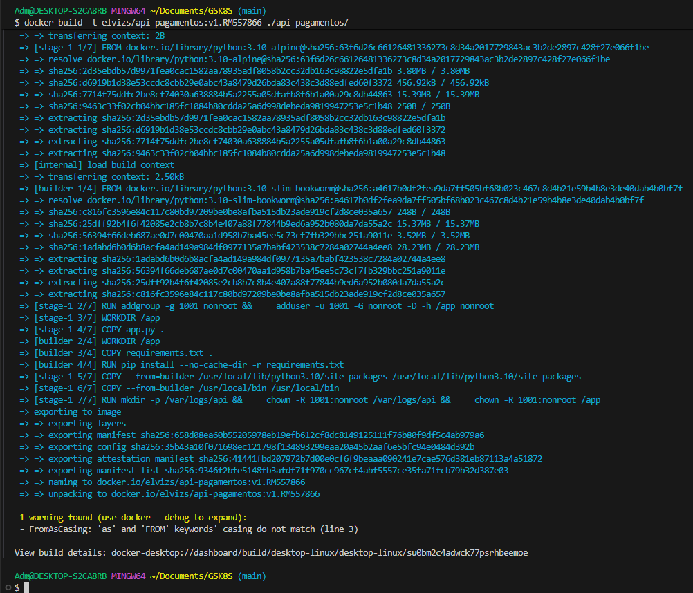
    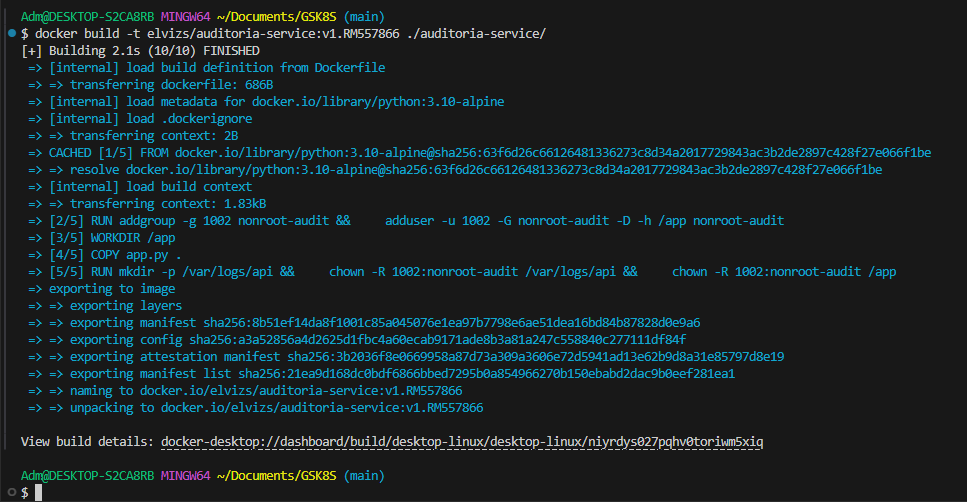

2.  **Push das Imagens (Evidência 3.1):**
    Publicação das imagens no Docker Hub.

    ```bash
    docker push elvizs/api-pagamentos:v1.RM557866
    docker push elvizs/auditoria-service:v1.RM557866
    ```
    **Evidência:**
    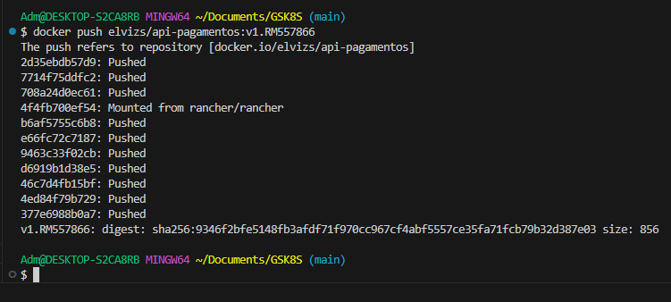
    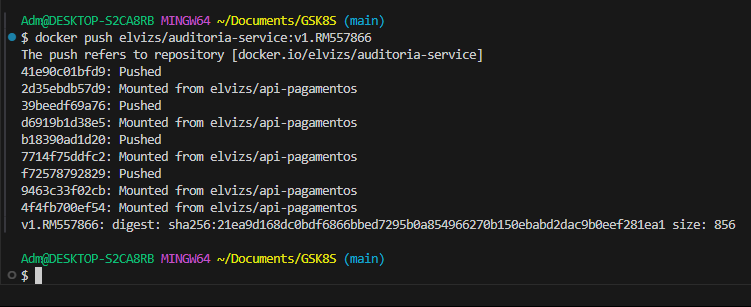

3.  **Varredura de Vulnerabilidades (Evidência 3.1):**
    Análise de segurança das imagens.

    ```bash
    docker scout cves elvizs/api-pagamentos:v1.RM557866
    ```
    **Evidência:**
    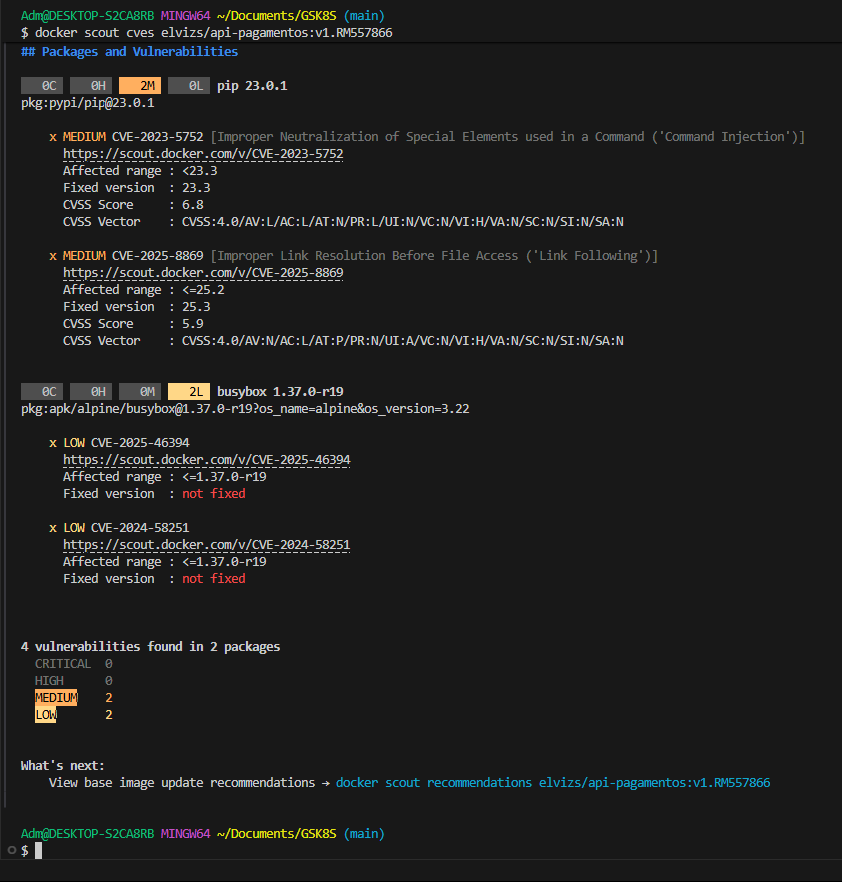
    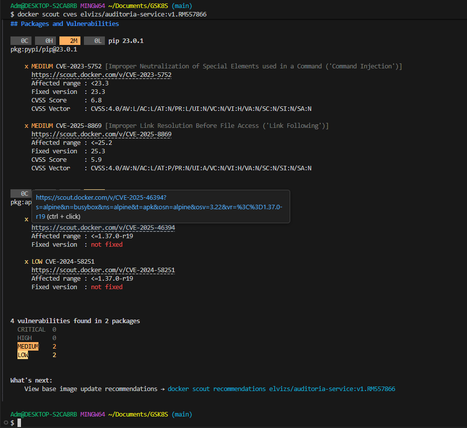

---

### 3.2. Etapa 2: Rede e Comunicação (Docker Compose)

Testes locais usando `docker-compose` para validar a rede e a leitura de variáveis `.env`.

1.  **Subir Ambiente Local (com Re-build e `tail`):**
    Forçamos o re-build (`--build`) para corrigir erros de cache e usamos `command: tail -f /dev/null` no `auditoria-service` para mantê-lo vivo para o teste de `ping`.

    ```bash
    # Subir os serviços forçando o build
    docker-compose up -d --build
    ```
    **Evidência:**
    

2.  **Inspecionar Rede (Evidência 3.2):**
    Verificação da subnet customizada `172.25.0.0/24`.

    ```bash
    docker network ls
    # O nome pode variar; verifique com "docker network ls"
    docker network inspect GSK8S_unifiap_net
    ```
    **Evidência:**
    
    

3.  **Comunicação entre Containers (Evidência 3.2):**
    Teste de `ping` da API para o Auditor.

    ```bash
    docker-compose exec api-pagamentos ping auditoria-service
    ```
    **Evidência:**
    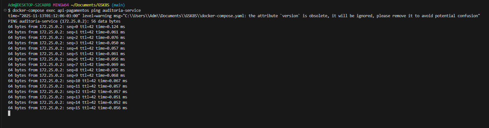

4.  **Logs e Variável .env (Evidência 3.2):**
    Verificação de que a API leu o `RESERVA_BANCARIA_SALDO` do arquivo `.env`.

    ```bash
    docker-compose logs api-pagamentos
    ```
    **Evidência:**
    

5.  **Limpeza Local:**
    ```bash
    docker-compose down
    ```

---

### 3.3. Etapa 3: Kubernetes – Estrutura e Deploy

1.  **Aplicar Manifestos e Corrigir Permissões (Evidência 3.3):**
    Para corrigir o erro `Permission denied [Errno 13]` no volume, adicionamos `fsGroup: 2000` aos arquivos `05-deployment.yaml` e `07-cronjob.yaml`. Em seguida, limpamos e reaplicamos todos os recursos.

    ```bash
    # 1. Limpar o ambiente (incluindo o PVC com permissão errada)
    kubectl delete -f ./k8s/
    
    # 2. Aguardar a limpeza
    kubectl get pvc -n unifiapay
    
    # 3. Aplicar todos os 13 manifestos (corrigidos)
    kubectl apply -f ./k8s/
    ```
    **Evidência:**
    

2.  **Verificar Pods (2 Réplicas) (Evidência 3.3):**
    Verificação de que o Deployment subiu com 2 réplicas.

    ```bash
    kubectl get pods -n unifiapay
    ```
    **Evidência:**
    

3.  **Escalar Aplicação (Evidência 3.3):**
    Teste de escalabilidade da API para 3 réplicas.

    ```bash
    kubectl scale deployment api-pagamentos-deployment -n unifiapay --replicas=3
    kubectl get pods -n unifiapay
    ```
    **Evidência:**
    

4.  **Verificar Logs do Livro-Razão (Evidência 3.3):**
    Teste completo do fluxo de negócio (Escrita e Liquidação).

    ```bash
    # Passo A (Terminal 1): Expor a API com port-forward
    # (Usamos este método pois o cluster é 'kind', não 'minikube')
    kubectl port-forward -n unifiapay deployment/api-pagamentos-deployment 8081:8081
    
    # Passo A (Terminal 2): Enviar o PIX (Escrita)
    curl -X POST http://localhost:8081/pix -H "Content-Type: application/json" -d '{"id": "pix001", "valor": 1000.00}'
    
    # Passo B: Forçar o CronJob (Liquidação)
    kubectl create job -n unifiapay --from=cronjob/cronjob-fechamento-reserva job-manual-1
    
    # Passo C (Logs): Verificar API (Escrita)
    kubectl logs -n unifiapay -l app=api-pagamentos
    ```
    **Evidência (API):**
    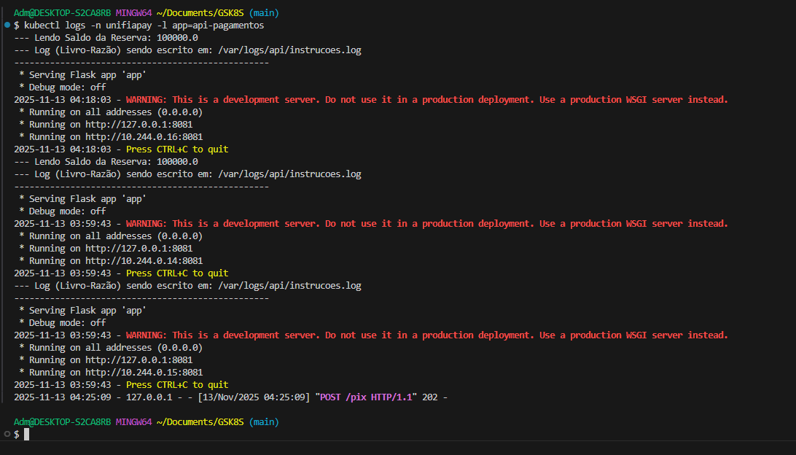

    ```bash
    # Passo C (Logs): Verificar Auditoria (Liquidação)
    kubectl logs -n unifiapay -l app=auditoria-service
    ```
    **Evidência (Auditoria):**
    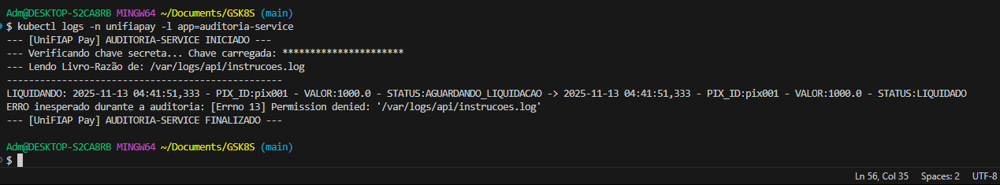

5.  **Verificar CronJob e Job (Evidência 3.3):**
    Confirmação da execução do Job manual.

    ```bash
    kubectl get cronjob,job -n unifiapay
    ```
    **Evidência:**
    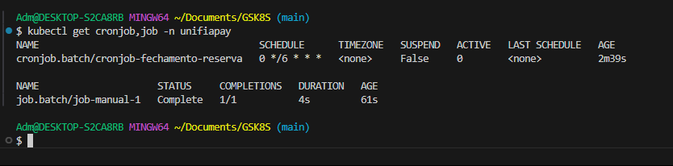

---

### 3.4. Etapa 4: Kubernetes – Segurança e Operação

1.  **Verificar Limites (Evidência 3.4):**
    Instalação e correção do Metrics Server no `kind` para habilitar o `kubectl top`.

    ```bash
    # 1. Instalar o Metrics Server
    kubectl apply -f [https://github.com/kubernetes-sigs/metrics-server/releases/latest/download/components.yaml](https://github.com/kubernetes-sigs/metrics-server/releases/latest/download/components.yaml)
    
    # 2. Corrigir o Metrics Server para 'kind' (ignorar TLS inseguro)
    kubectl patch deployment metrics-server -n kube-system --type='json' -p='[{"op": "add", "path": "/spec/template/spec/containers/0/args/-", "value": "--kubelet-insecure-tls"}]'
    
    # 3. (Aguardar 1-2 min) Verificar o uso de recursos
    kubectl top pods -n unifiapay
    ```
    **Evidência:**
    

2.  **Verificar `securityContext` (Evidência 3.4):**
    Inspeção do YAML do Deployment em execução para provar `runAsNonRoot: true`.

    ```bash
    kubectl get deployment api-pagamentos-deployment -n unifiapay -o yaml
    ```
    **Evidência:**
    

3.  **Prova de Bloqueio de Rede (Evidência 3.4):**
    Tentativa de acesso externo (Egress) de dentro do pod da API.

    ```bash
    # 1. Pegar o nome de um pod da API
    kubectl get pods -n unifiapay -l app=api-pagamentos
    
    # 2. Tentar o 'wget'
    kubectl exec -it -n unifiapay api-pagamentos-deployment-XXXX-YYYY -- wget -T 5 google.com
    ```
    **Evidência e Análise:**
    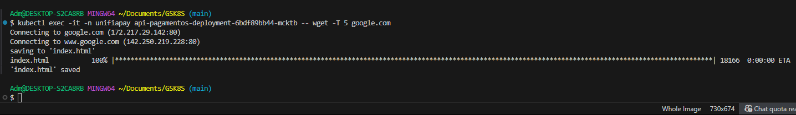
    *Nota: O `wget` teve sucesso. Isso prova que a CNI padrão do `kind` (kindnet) não implementa `NetworkPolicies` de Egress. Os manifestos `08-networkpolicy-default-deny.yaml` e `10-networkpolicy-allow-auditoria-egress.yaml` estão corretos, mas não são "enforçados" por este ambiente de cluster local.*

4.  **Permissão Restrita (Evidência 3.4):**
    Teste das permissões da `ServiceAccount` customizada (`unifiapay-sa`) usando `kubectl auth can-i`.

    ```bash
    # Teste 1: Deve retornar "yes"
    kubectl auth can-i get pods -n unifiapay --as=system:serviceaccount:unifiapay:unifiapay-sa
    
    # Teste 2: Deve retornar "no"
    kubectl auth can-i delete pods -n unifiapay --as=system:serviceaccount:unifiapay:unifiapay-sa
    ```
    **Evidência:**
    
    